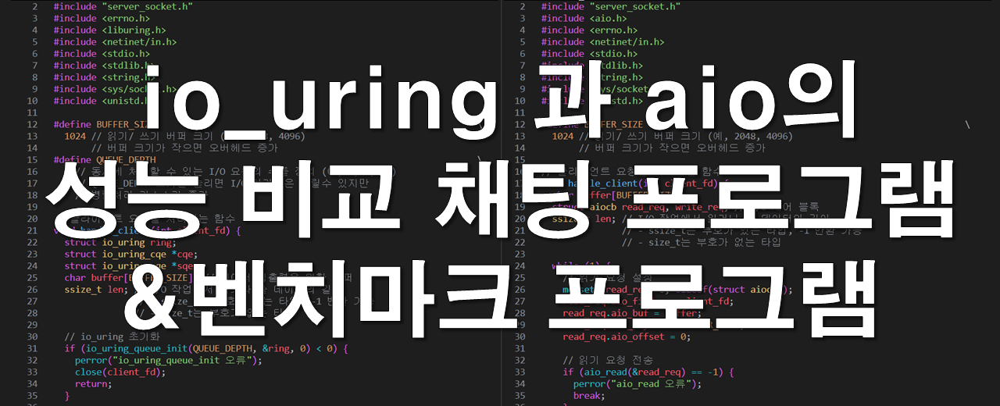
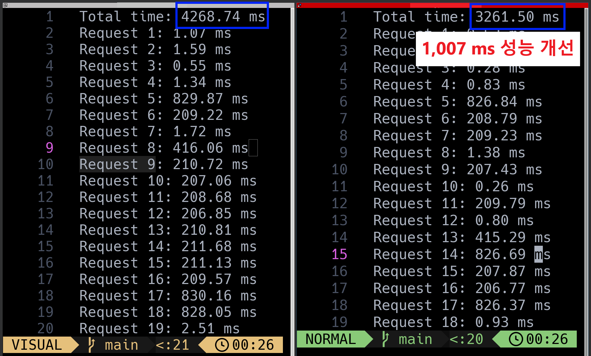
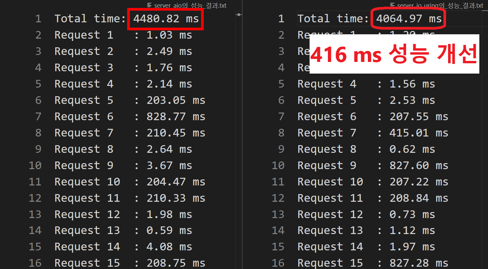

# io_uring vs aio
<p align="center">
  
</p>

 **본 프로젝트는 io_uring과 aio의 성능을 비교하기 위한 채팅 프로그램과 벤치마크 프로그램입니다.**  
 io_uring은 2019년 5월 리눅스 커널 5.1에 추가된 새로운 비동기 I/O 처리 모델로, **높은 성능과 효율성을 제공합니다.**  
 본 프로젝트에서는 기존의 비동기 모델인 **aio의 iocb(I/O Control Block) 구조와 io_uring의 SQ(Submission Queue)와 CQ(Completion Queue) 구조를 파악**하고, **두 모델의 코드를 최대한 유사하게 작성하여 성능 차이를 비교하는 것을 목표**로 합니다.  

코드에 대한 간단한 설명을 원하시면 실험의 [실험 설명](#실험)을 참고해주세요.

## 주요기능
* **비동기 I/O 기반 채팅 서버**
    * **io_uring 기반 채팅 서버 및 클라이언트**
        - 최신 io_uring 모델을 활용하여 비동기 I/O 처리를 구현한 채팅 프로그램입니다.
    * **aio 기반 채팅 서버 및 클라이언트**
        - 기존의 aio 모델을 활용하여 비동기 I/O 처리를 구현한 채팅 프로그램입니다.
* **성능 비교 벤치마크**
    * io_uring과 aio 기반 서버의 응답 시간과 동시성 성능을 비교하는 벤치마크 프로그램입니다.


## 사용 방법

### 1. 환경 설정
Ubuntu 또는 Arch Linux에서 필요한 종속성과 라이브러리 설치:
- **Ubuntu**:
  ```bash
  sudo apt update && sudo apt install git make gcc liburing-dev libaio-dev
  ```
- **Arch Linux**:
  ```bash
  sudo pacman -S git make gcc liburing libaio
  ```

### 2. 코드 컴파일 
```bash
make
```

### 3. 벤치마크 프로그램 실행 
```bash
cd build/ && ./benchmark
```

## 실험
### 1.실험 컴퓨터 사양
- OS: Arch Linux   
- Kernel: 6.6.49-1-lts  
- CPU: 13th Gen Intel i7-1370P (20) @ 5.000GHz   
- Memory: 16GB 

### 2. 실험 설명
 앞서 말했다시피 본 프로젝트에서는 io_uring 기반과 aio 기반의 채팅 서버 프로그램의 성능을 비교합니다.  
 성능 측정을 위해, 클라이언트(benchmark)는 서버에 총 1,000개의 요청을 50개의 클라이언트 스레드를 통해 동시에 나누어 보냅니다. 각 클라이언트 스레드는 서버에 연결하여 "Hello, World!" 메시지를 전송하고 응답 시간을 기록합니다. 성능 검사는 서버 프로그램(server_aio와 server_io_uring) 각각에 대해 독립적으로 수행되며, 결과는 txt 파일로 됩니다.

보다 자세한 코드 설명을 원하시면 각 코드의 주석들을 참고 바랍니다.

### 3. 실험 추가 설명
코드에서 버퍼 사이즈를 늘리면 초 단위로 성능 차이가 나지만,  
본 프로젝트에서는 범용성을 생각하여 **버퍼 사이즈를 1024로 설정**했습니다.

### 4. 실험 결과
##### 1. 버퍼 사이즈 크기가 4096인 경우
<p align="center">
  
</p>


##### 1. 버퍼 사이즈 크기가 1024인 경우
<p align="center">
  
</p>

##### NOTE
* 추후 멀티 스레드로 코드 개선하기.
* 추후 버퍼 크기로 동적으로 조절할 수 있게 하기.
* 추후 데이터를 처리할 때 데이터를 인코딩/디코딩을 하거나 압축해서 하기.
